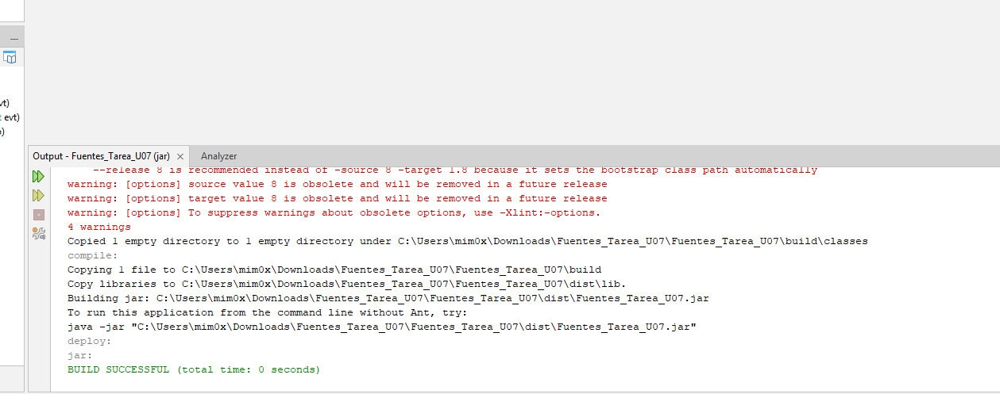
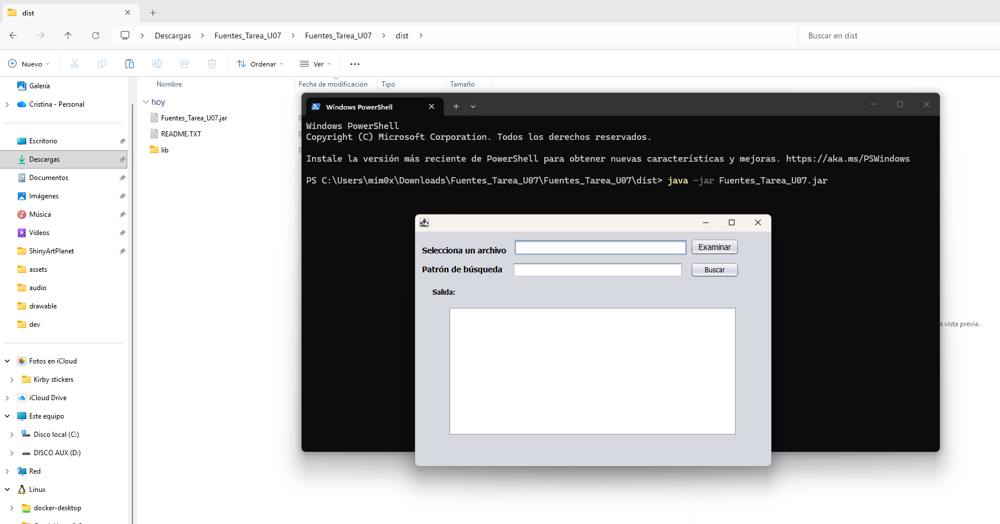
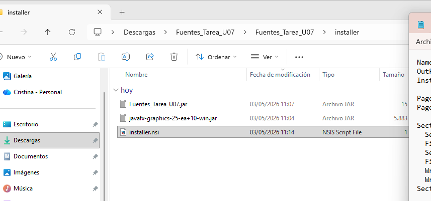
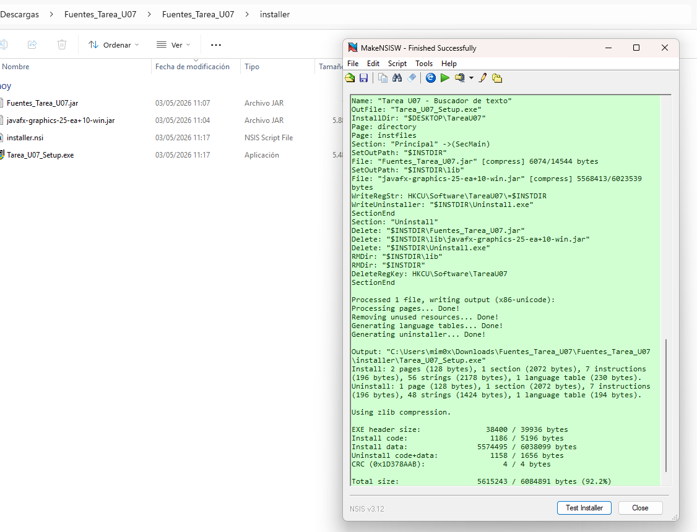
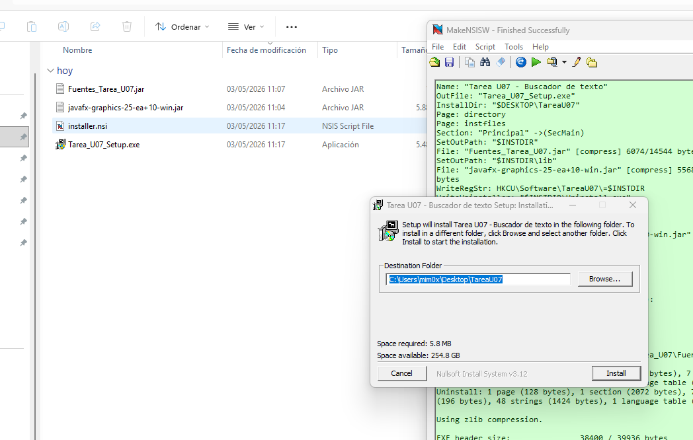
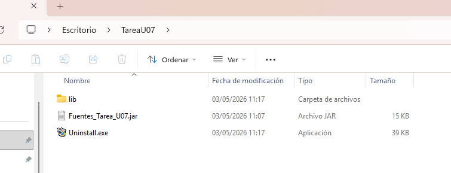

# Tarea DI07 — Empaquetado y distribución de aplicación Java

**Módulo:** Desarrollo de Interfaces  
**Unidad:** 07 — Empaquetado y distribución de aplicaciones  
**Cristina García Quintero**
**Fecha:** _03/05/2026_
**[Enlace al proyecto completo](https://github.com/little-shiny/DI07)**

---

## Índice

- [Tarea DI07 — Empaquetado y distribución de aplicación Java](#tarea-di07--empaquetado-y-distribución-de-aplicación-java)
  - [Índice](#índice)
  - [1. Descripción de la tarea](#1-descripción-de-la-tarea)
  - [2. Creación del proyecto con el código fuente proporcionado](#2-creación-del-proyecto-con-el-código-fuente-proporcionado)
  - [3. Compilación del proyecto y generación del `.JAR`](#3-compilación-del-proyecto-y-generación-del-jar)
  - [4. Creación del instalador con NSIS](#4-creación-del-instalador-con-nsis)
    - [4.1 Instalación de NSIS](#41-instalación-de-nsis)
    - [4.2 Preparación de los archivos](#42-preparación-de-los-archivos)
    - [4.3 Creación del script para NSIS](#43-creación-del-script-para-nsis)
    - [4.4 Compilación del script](#44-compilación-del-script)
    - [4.5 Ejecución del instalador](#45-ejecución-del-instalador)
    - [4.6 Carpeta final del programa](#46-carpeta-final-del-programa)
  - [5. Conclusión](#5-conclusión)

---

## 1. Descripción de la tarea

La tarea consiste en dos partes diferenciadas. En primer lugar, se parte del código fuente de una aplicación Java de escritorio que permite seleccionar un fichero de texto y buscar en su interior un patrón de texto. El objetivo es importar dicho código en un nuevo proyecto, añadir las librerías necesarias, compilar la aplicación y generar un fichero JAR ejecutable.

En segundo lugar, se utiliza la herramienta NSIS (Nullsoft Scriptable Install System) para crear un instalador Windows que permita distribuir e instalar la aplicación en cualquier equipo con sistema operativo Microsoft Windows.

---

## 2. Creación del proyecto con el código fuente proporcionado

Se abre NetBeans y se abre el proyecto que se proporcionaba en el enunciado, configurándolo como proyecto Java.


La aplicación hace uso de clases pertenecientes a la librería JavaFX. Siguiendo las indicaciones, se descarga la librería necesaria `javafx-graphics-25-ea+10-win.jar` desde la siguiente [URL](https://repo1.maven.org/maven2/org/openjfx/javafx-graphics/25-ea+10/)

Dentro de NetBeans, se añade la librería con "AddJAR/Folder.." y se selecciona el `.jar` de la librería descargada

---

## 3. Compilación del proyecto y generación del `.JAR`

Con el proyecto configurado y las dependencias añadidas, se procede a compilar mediante **Build**. La pestaña de resultados en la parte inferior del IDE muestra el proceso de compilación sin errores.



Ya generado el archivo `.jar` de salida del proyecto, se comprueba que externamente (fuera de NetBeans) el fichero se puede ejecutar correctamente. Para ello, se utiliza la consola de Windows:
```
java -jar Tarea_U07.jar
```



Como se observa se puede ejecutar sin ningún problema y muestra su interfaz gráfica.

---

## 4. Creación del instalador con NSIS

### 4.1 Instalación de NSIS

Se descarga NSIS desde su [página oficial](https://nsis.sourceforge.io/Main_Page) y se instala con las opciones por defecto. Al abrirlo aparece la pantalla principal donde se selecciona "Compile NSI Scripts" para crear el instalador a partir de un script que se creará.

### 4.2 Preparación de los archivos

Se crea una carpeta llamada `installer` y se copian en ella los siguientes archivos necesarios para la compilación del script:

- `Fuentes_Tarea_U07.jar` — aplicación principal
- `javafx-graphics-25-ea+10-win.jar` — librería JavaFX requerida
- `installer.nsi` — script de instalación
- 


### 4.3 Creación del script para NSIS 

Para poder crear el instalador se crea un script, que establece el nombre del archivo de salida (`OutFile "Tarea_U07_Setup.exe`) y la ubicación de la carpeta de instalación por defecto que se le muestra al usuario, en este caso, el escritorio (`InstallDir "$DESKTOP\TareaU07`).

En segundo lugar se definen las pantallas que se muestran durante la instalación, una es la que elige la ruta de la instalación y otra que muestra el proceso:

```bash
Page directory
Page instfiles
```
En la sección prinicpal se especifica lo que hace al instalar. `SetOutPath` indica la carpeta de destino escogida por el usuario.
Posteriormente se escribe una clave en el registro de windows para el usuario actual especificando la ruta del registro, el valor por defecto y lo que se guarda (la ruta de instalación del programa)

Finalmente se escibe la sección de desinstalación que elimina los archivos del programa y la clave de registro:
```bash
Section "Uninstall"
  Delete "$INSTDIR\Tarea_U07.jar"
  Delete "$INSTDIR\lib\javafx-graphics-25-ea+10-win.jar"
  Delete "$INSTDIR\Uninstall.exe"
  RMDir "$INSTDIR\lib"
  RMDir "$INSTDIR"
  DeleteRegKey /ifempty HKCU "Software\TareaU07"
SectionEnd
```


### 4.4 Compilación del script

Se abre NSIS y se carga el archivo `installer.nsi` arrastrándolo a la ventana. NSIS procesa el script y genera el instalador `Tarea_U07_Setup.exe`. La ventana muestra el mensaje en verde.



### 4.5 Ejecución del instalador

Se ejecuta el archivo `Tarea_U07_Setup.exe` generado. El asistente de instalación muestra la pantalla de selección de carpeta de destino con la ruta por defecto en el escritorio del usuario. Tras confirmar, se realiza la instalación copiando los archivos en la carpeta indicada y registrando la clave correspondiente en el registro de Windows.



### 4.6 Carpeta final del programa

FInalmente al acabar la instalación del programa, podemos ver como se ha creado la carpeta con el programa en la ubicación escogida, con su asistente de desinstalación y las dependencias:



---

## 5. Conclusión

La realización de esta tarea ha permitido comprender el proceso completo de empaquetado y distribución de una aplicación Java de escritorio, abarcando desde la importación de código fuente existente hasta la generación de un instalador funcional para sistemas Windows.

En la primera parte se ha trabajado para estructurar correctamente el proyecto, gestionar dependencias externas mediante la incorporación manual de librerías JAR y generar un artefacto ejecutable de forma autónoma fuera del entorno de desarrollo. Este proceso pone de manifiesto la importancia de incluir todas las dependencias necesarias junto al ejecutable para garantizar su correcto funcionamiento en cualquier equipo.

En la segunda parte se ha utilizado NSIS como herramienta de creación de instaladores, aprendiendo a redactar scripts que automatizan la copia de archivos, la escritura de claves en el registro de Windows y la generación del desinstalador correspondiente. Se ha comprobado que pequeños detalles como la codificación del archivo de script o el nombre exacto de las secciones son críticos para que la compilación se realice con éxito.

En conjunto, la tarea refleja un flujo de trabajo real en el desarrollo de software, donde la distribución de la aplicación es una fase tan importante como su propio desarrollo, ya que determina si el producto final puede llegar correctamente al usuario final.